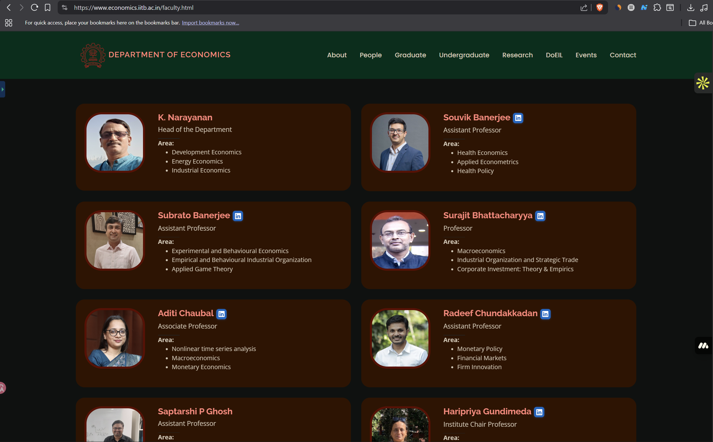

# 🔵 LinkedIn Profile Finder — Chrome Extension (MV3)

A lightweight, professional Chrome extension that automatically detects people's names on academic and profile-based webpages and injects a small LinkedIn search button next to each name.

---

## 📁 Project Structure

```
linkedin-profile-finder/
├── manifest.json       # MV3 extension manifest
├── content.js          # Core DOM scanning + injection logic
├── styles.css          # Injected button & tooltip styles
├── popup.html          # Extension popup UI
├── test-page.html      # Local test page (IIT Bombay faculty mock)
└── icons/
    ├── icon16.png
    ├── icon48.png
    └── icon128.png
```

---

## 🚀 Installation (Developer Mode)

1. Open Chrome and navigate to `chrome://extensions/`
2. Enable **Developer mode** (top-right toggle)
3. Click **"Load unpacked"**
4. Select the `linkedin-profile-finder/` folder
5. The extension is now active on all pages ✅

---

## 🧪 Testing Locally

Open `test-page.html` in Chrome **after** installing the extension:

1. You should see LinkedIn **🔵 buttons** next to each faculty name
2. Click **"Load Visiting Faculty"** to test MutationObserver (dynamic content)
3. Hover any button to see the **"View LinkedIn Profile"** tooltip
4. Click a button → LinkedIn search opens in a new tab with name + institution

---

## ⚙️ How It Works

### Name Detection
- Queries CSS selectors like `.faculty-name`, `.profile-name`, `.staff-name`, `[itemprop="name"]`, and headings inside profile containers
- Validates text against a regex for plausible human names (2–5 capitalised words, optional prefix)
- Filters out stop-words (department names, navigation labels, etc.)

### Institution Detection
Automatically extracts institution from:
1. `<title>` tag
2. `<meta name="description">` content
3. `<meta property="og:site_name">` content
4. Page hostname as fallback

### LinkedIn Search URL
```
https://www.linkedin.com/search/results/people/?keywords=NAME+INSTITUTION
```

### Duplicate Prevention
Each processed element is marked with `data-lpf-processed="true"` to prevent re-injection on re-renders.

### Dynamic Content
A `MutationObserver` watches for DOM additions and re-scans after a **300ms debounce**, making it compatible with React, Vue, Angular, and other SPA frameworks.

---

## 🔒 Permissions

| Permission | Reason |
|---|---|
| `activeTab` | Access current tab context |
| `scripting` | Inject content scripts programmatically |
| `host_permissions: <all_urls>` | Run on all academic/profile pages |

---

## 🎨 UI Design

- **Size:** 24×24px button, icon-only — minimal footprint
- **Color:** LinkedIn Blue `#0A66C2`
- **Hover:** `scale(1.15)` + `brightness(1.12)` + stronger shadow
- **Tooltip:** "View LinkedIn Profile" — appears above button on hover
- **Rounded edges:** `border-radius: 6px`

---

## 🌐 Tested Pages

- IIT / NIT faculty directories
- University "People" pages
- Any page with `.faculty-name`, `.profile-name`, `.staff-name` classes
- Pages with profile cards containing headings inside `.card`, `.team`, `.member` containers

---

## Screenshots


---

## 📌 Notes

- Does **not** violate LinkedIn's ToS — only opens a standard search URL
- No data is collected or transmitted; all logic runs locally in the browser
- Extension is entirely client-side, no backend required
